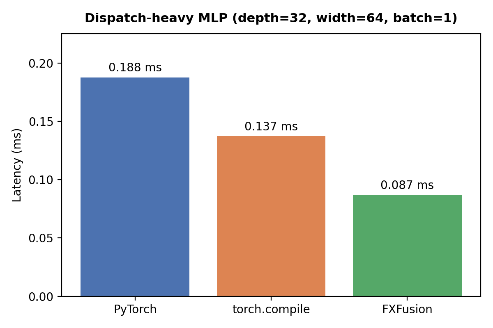
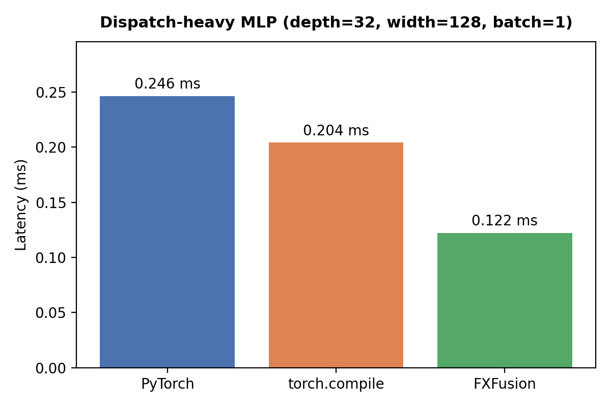
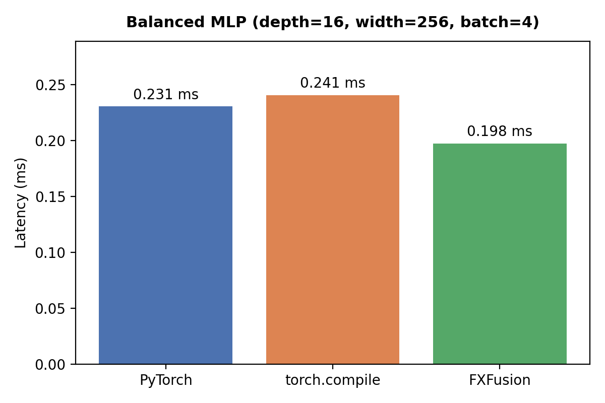
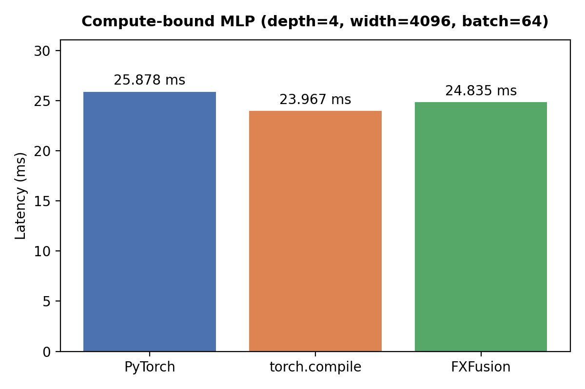
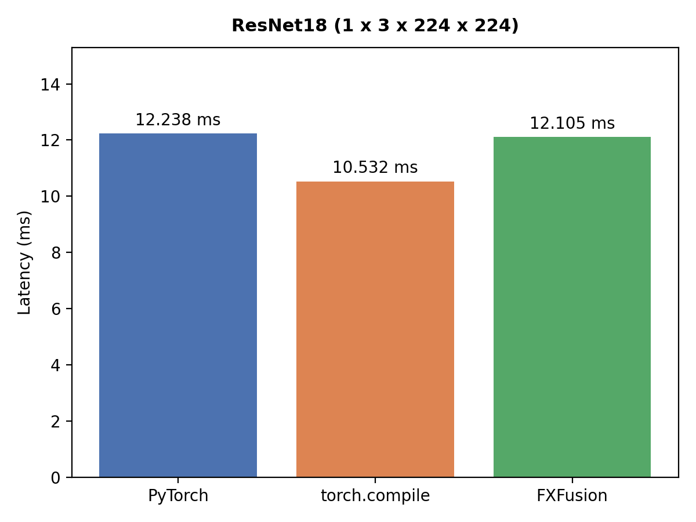
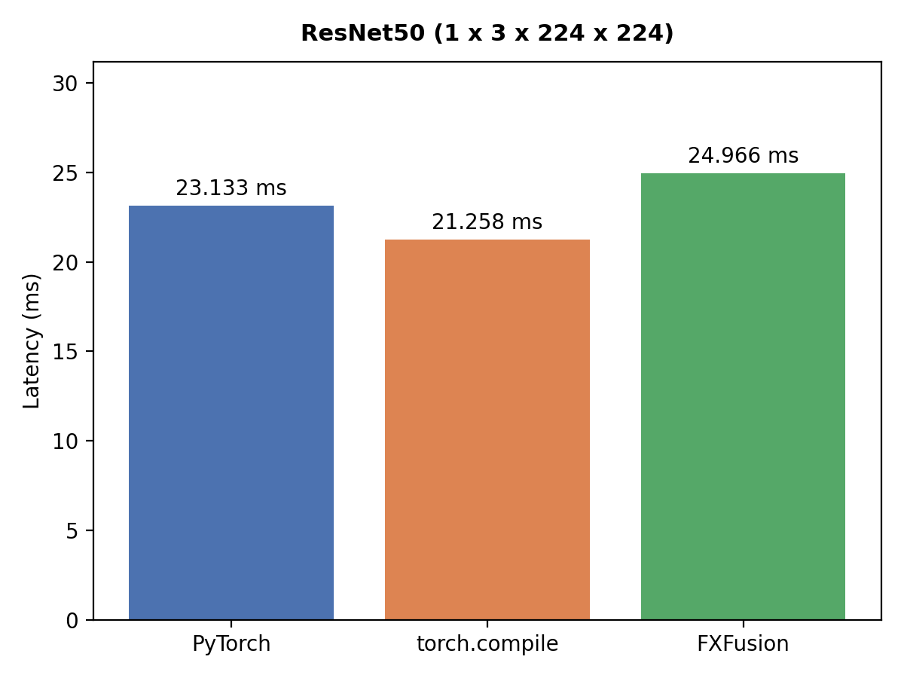

# FXFusion Benchmarks

This document contains benchmark results comparing FXFusion against PyTorch eager execution and `torch.compile`.

## Benchmark Configuration

### Methodology

- 100 warmup iterations before timing
- 5000 measured iterations per benchmark
- CPU timings collected using `time.perf_counter()`
- Reported latency is the average latency per inference
- All models executed in inference mode with gradient computation disabled

### CPU Backend

- PyTorch: Eager execution
- torch.compile: TorchInductor default configuration
- FXFusion: RuntimeGraph execution engine with operator fusion, static memory planning, arena-backed tensor storage, and function-pointer dispatch

---

# CPU Benchmarks

## Dispatch-Heavy MLP (depth=32, width=64, batch=1)

### Result

- 2.16× lower latency than PyTorch eager execution
- 1.58× lower latency than torch.compile

---

## Dispatch-Heavy MLP (depth=32, width=128, batch=1)

### Result

- 2.02× lower latency than PyTorch eager execution
- 1.67× lower latency than torch.compile

---

## Balanced MLP (depth=16, width=256, batch=4)

### Result

FXFusion outperforms both PyTorch eager execution and torch.compile.

---

## Compute-Bound MLP (depth=4, width=4096, batch=64)

### Result

Performance converges toward the underlying BLAS implementation used by LibTorch.

---

## ResNet-18 (1 × 3 × 224 × 224)

### Result

FXFusion slightly outperforms both PyTorch eager execution and torch.compile.

---

## ResNet-50 (1 × 3 × 224 × 224)

### Result

FXFusion achieves performance parity with PyTorch eager execution on a production-scale CNN.

---

# CUDA Benchmarks

CUDA benchmarks will be added as custom kernels are implemented.

## Planned Benchmarks

### Dispatch-Heavy MLP

- Linear + ReLU fusion
- Runtime dispatch overhead analysis
- Comparison against PyTorch eager and torch.compile

### Compute-Bound MLP

- cuBLAS GEMM
- cuBLASLt fused bias + ReLU epilogues
- Mixed precision (FP16/BF16)

### CNN Models

- ResNet-18
- ResNet-50

### Future Models

- Vision Transformers
- Transformer encoder blocks

---

# Interpretation

### Dispatch-Heavy Workloads

FXFusion consistently outperforms both PyTorch eager execution and torch.compile on deep, small-batch MLPs where runtime and operator dispatch overhead dominate execution time.

### Compute-Bound Workloads

As workloads become dominated by large matrix multiplications and convolution operations, performance naturally converges toward the underlying LibTorch and BLAS implementation used by the CPU backend.

### CNN Workloads

FXFusion achieves near-parity with PyTorch eager execution on ResNet-18 and ResNet-50 while executing through the custom compiler pipeline, memory planner, RuntimeGraph execution engine, and backend dispatch infrastructure.

---

# Raw Benchmark Files

Generated charts:

- `assets/imgs/cpu_mlp_dispatch_32x64.png`
- `assets/imgs/cpu_mlp_dispatch_32x128.png`
- `assets/imgs/cpu_mlp_balanced_16x256.png`
- `assets/imgs/cpu_mlp_compute_4x4096.png`
- `assets/imgs/cpu_resnet18.png`
- `assets/imgs/cpu_resnet50.png`

Raw benchmark results:

- `assets/results/cpu_mlp_dispatch_32x64.csv`
- `assets/results/cpu_mlp_dispatch_32x128.csv`
- `assets/results/cpu_mlp_balanced_16x256.csv`
- `assets/results/cpu_mlp_compute_4x4096.csv`
- `assets/results/cpu_resnet18.csv`
- `assets/results/cpu_resnet50.csv`