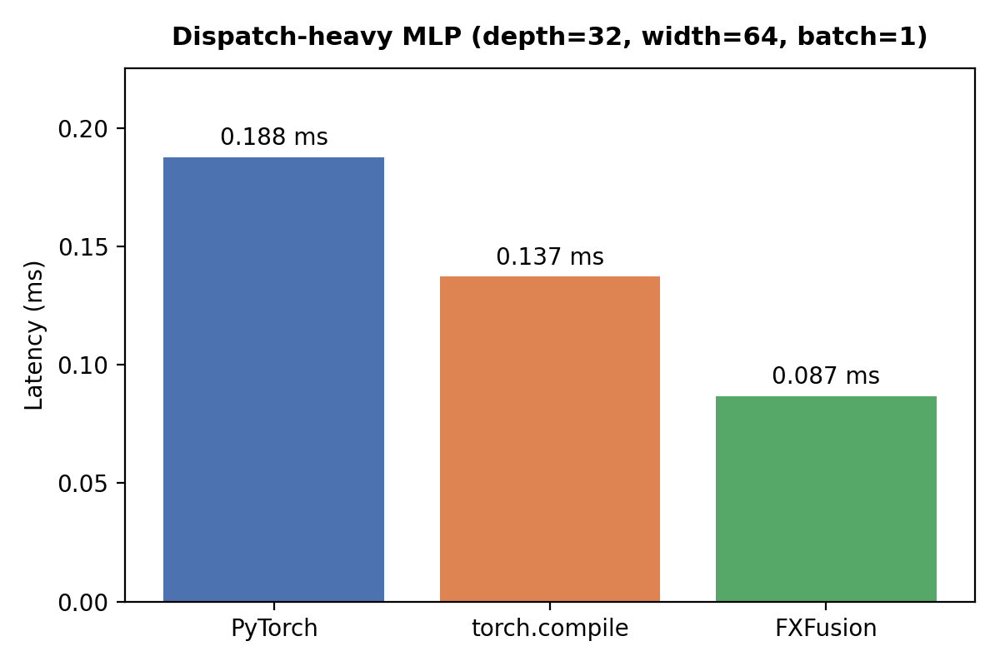
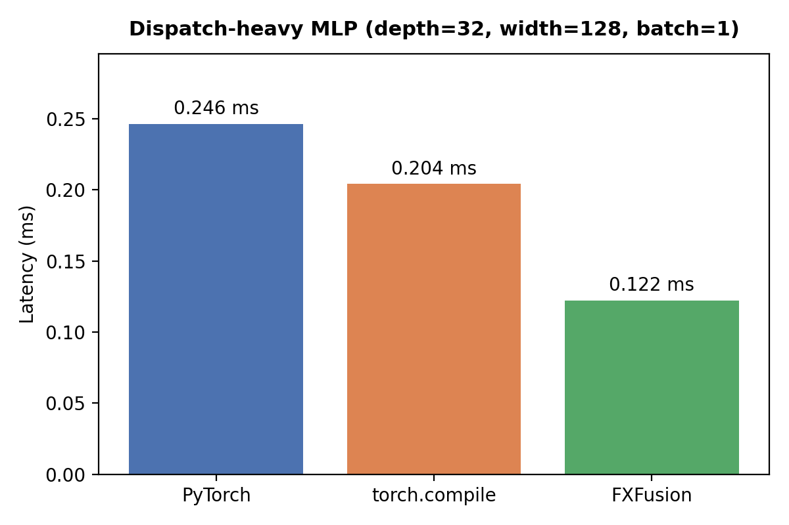
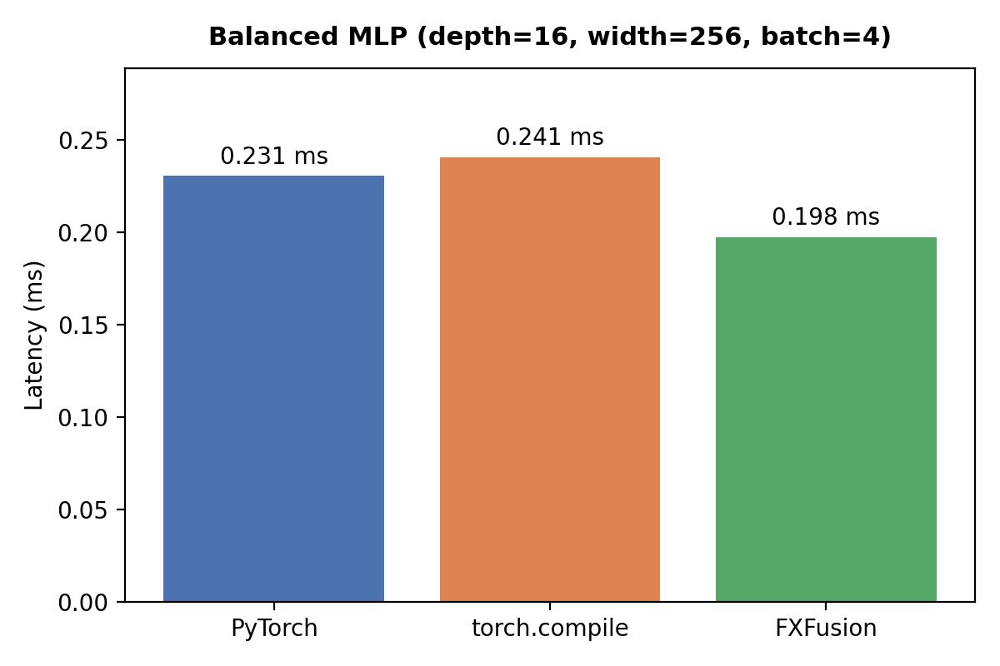
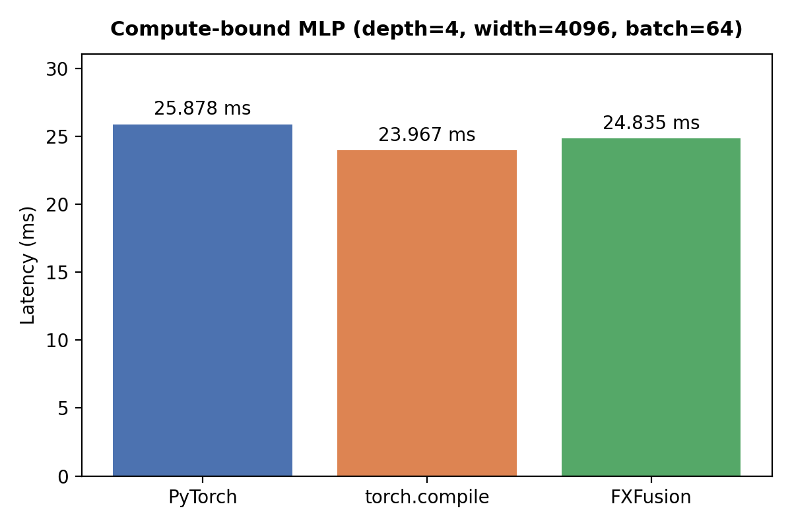
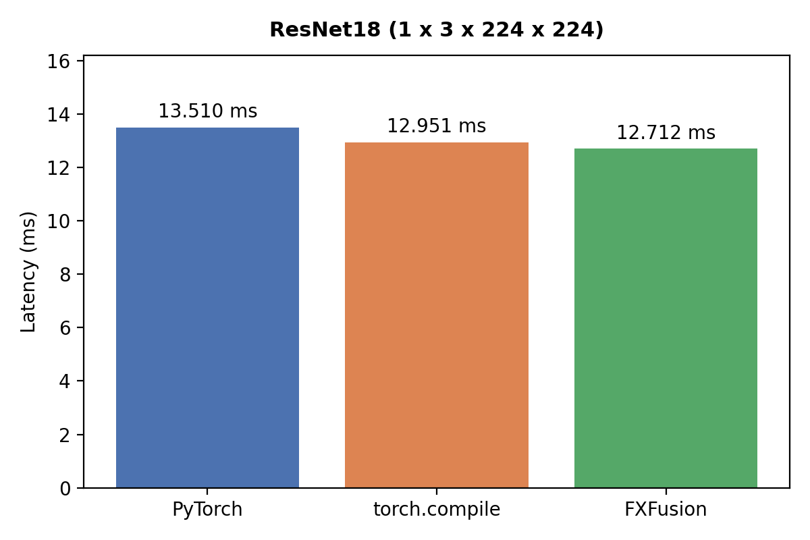
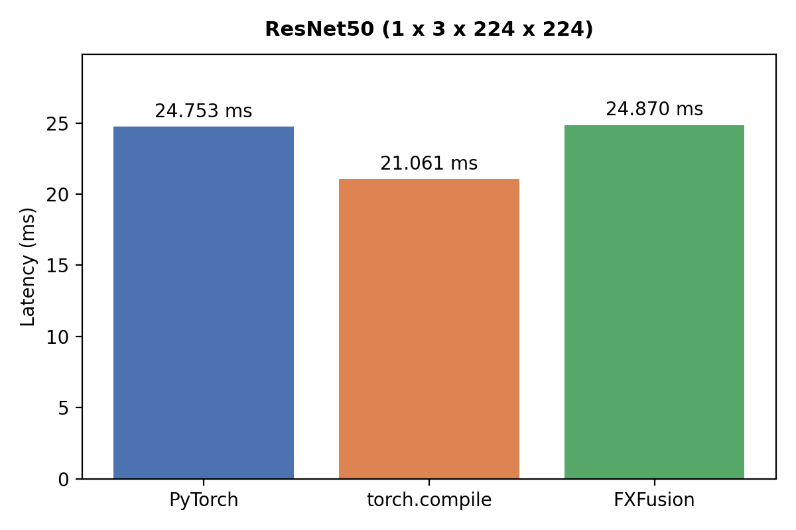

# FXFusion CPU Benchmarks

This document contains benchmark results comparing FXFusion against PyTorch eager execution and `torch.compile` on the CPU acceleration backend.

## Benchmark Configuration

### Methodology
- 100 warmup iterations before timing
- 5000 measured iterations per benchmark
- CPU timings collected using `time.perf_counter()`
- Reported latency is the average latency per inference pass
- All models executed in inference mode with gradient computation disabled

### CPU Hardware Environment
- **Device Targeted:** Apple MacBook Pro M1
- **PyTorch:** Eager execution loop
- **torch.compile:** TorchInductor default CPU configuration
- **FXFusion:** RuntimeGraph execution engine utilizing operator fusion, static memory planning, arena-backed tensor storage, and function-pointer dispatch.

---

# CPU Performance Benchmarks

## Dispatch-Heavy MLP (Depth=32, Width=64, Batch=1)

### Result
- 2.16× lower latency than PyTorch eager execution
- 1.58× lower latency than torch.compile

---

## Dispatch-Heavy MLP (Depth=32, Width=128, Batch=1)

### Result
- 2.02× lower latency than PyTorch eager execution
- 1.67× lower latency than torch.compile

---

## Balanced MLP (Depth=16, Width=256, Batch=4)

### Result
- Outperformance achieved relative to both PyTorch eager execution and torch.compile

---

## Compute-Bound MLP (Depth=4, Width=4096, Batch=64)

### Result
- Performance convergence toward the underlying BLAS implementation utilized by LibTorch

---

## ResNet-18 (1 × 3 × 224 × 224)

### Result
- Slight outperformance achieved relative to both PyTorch eager execution and torch.compile

---

## ResNet-50 (1 × 3 × 224 × 224)

### Result
- Performance parity achieved with PyTorch eager execution on a production-scale CNN

---

# Core Architectural Interpretation

### Dispatch-Heavy Workloads
FXFusion consistently outperforms both PyTorch eager execution and torch.compile on deep, small-batch MLPs where runtime and operator dispatch overhead dominate execution bounds.

### Compute-Bound Workloads
As workloads become dominated by large matrix multiplications and convolution operations, performance naturally converges toward the underlying LibTorch and BLAS implementation utilized by the CPU backend.

### CNN Workloads
Near-parity is achieved relative to PyTorch eager execution on ResNet-18 and ResNet-50 while executing through the custom compiler pipeline, memory planner, RuntimeGraph execution engine, and backend dispatch infrastructure.

---

# Raw Evaluation Data
Detailed benchmark execution tracking values are recorded across the following artifacts:
- `benchmarks/assets/results/cpu_*.csv`
- `benchmarks/assets/imgs/cpu_*.png`