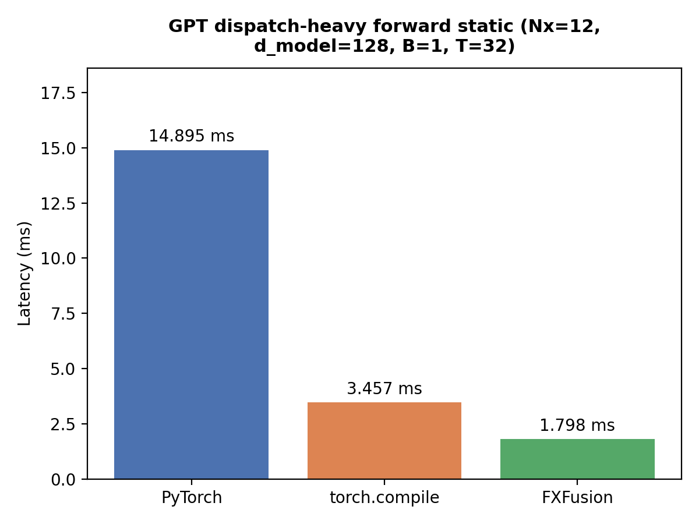
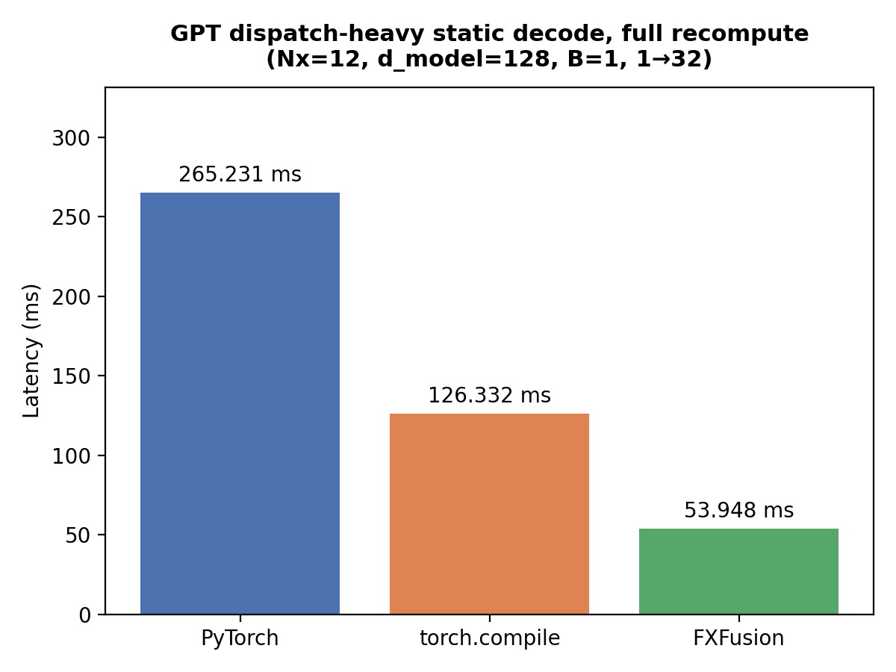
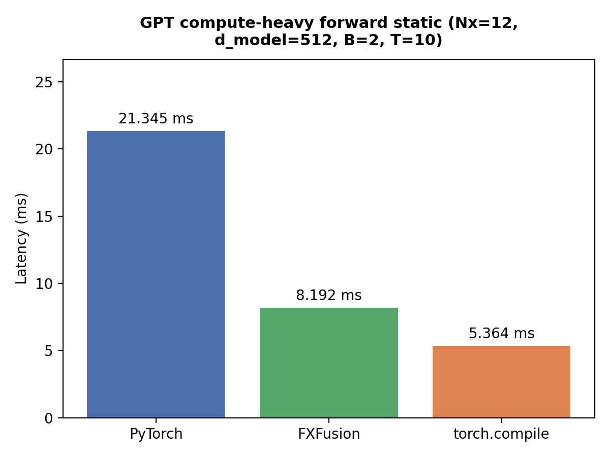
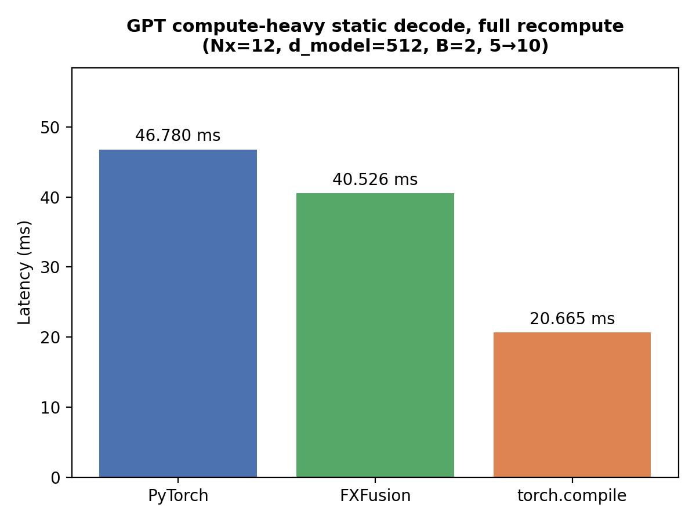

# FXFusion CUDA Benchmarks

This document contains benchmark results comparing FXFusion against PyTorch eager execution and `torch.compile` on the CUDA acceleration backend.

## Benchmark Configuration

### Methodology
- 20 warmup iterations (dispatch-heavy) / 10 warmup iterations (compute-bound)
- 300 measured iterations (dispatch-heavy) / 100 measured iterations (compute-bound)
- Timing captured via host-synchronized `torch.cuda.Event` stream profiling
- Reported latency is the average latency per inference pass
- All models executed in inference mode with gradient computation disabled

### CUDA Hardware Environment
- **Device Targeted:** NVIDIA T4 GPU (Google Colab)
- **PyTorch:** Eager CUDA execution loop
- **torch.compile:** TorchInductor CUDA backend running with default optimization targets
- **FXFusion:** RuntimeGraph engine driving custom hand-written, shared-memory-tiled kernels and a single-kernel fused `FlashAttention` implementation.

---

# CUDA Performance Benchmarks

## GPT Dispatch-Heavy Forward Static (Nx=12, d_model=128, B=1, T=32)

### Result
- 8.29× lower latency than PyTorch eager execution
- 1.92× lower latency than torch.compile

*Note: When many small kernels are launched one after another, FXFusion’s pre-planned memory arena and direct function-pointer dispatch remove most of the host-side launch overhead that still shows up in eager and compiled PyTorch.*

---

## GPT Dispatch-Heavy Static Decode, Full Recompute (Nx=12, d_model=128, B=1, 1→32)

### Result
- 4.92× lower latency than PyTorch eager execution
- 2.34× lower latency than torch.compile

---

## GPT Compute-Bound Forward Static (Nx=12, d_model=512, B=2, T=10)

### Result
- 2.61× lower latency than PyTorch eager execution
- Performance trails `torch.compile` (FXFusion at 0.65× relative performance)

---

## GPT Compute-Bound Static Decode, Full Recompute (Nx=12, d_model=512, B=2, 5→10)

### Result
- 1.15× lower latency than PyTorch eager execution
- Performance trails `torch.compile` (FXFusion at 0.51× relative performance)

---

# Core Architectural Interpretation

### Small Hidden Dimensions (`d_model=128`)
These workloads are limited by CPU launch overhead, not by GPU math. FXFusion lowers the model ahead of time into a flat list of function pointers and runs them in one tight C++ loop, so the host spends almost no time between kernels. That is why the speedups are largest here.

### Wide Hidden Dimensions (`d_model=512`)
With larger GEMMs the bottleneck shifts to raw floating-point throughput. FXFusion’s hand-written shared-memory kernels avoid PyTorch’s allocation and bookkeeping costs, but they do not yet use NVIDIA’s Tensor-Core code paths. Adding `cuBLASLt` for the big matrix multiplies is the next step to close the remaining gap with `torch.compile`.

### FlashAttention
The custom FlashAttention kernel keeps the running max and softmax denominator in registers and shared memory, never writing the full (`NxN`) attention matrix. This cuts memory traffic and keeps the T4 from becoming bandwidth-bound on longer sequences.

---

# Raw Evaluation Data
Detailed benchmark execution tracking values are recorded across the following artifacts:
- `benchmarks/assets/results/cuda0_*.csv`
- `benchmarks/assets/imgs/cuda0_*.png`